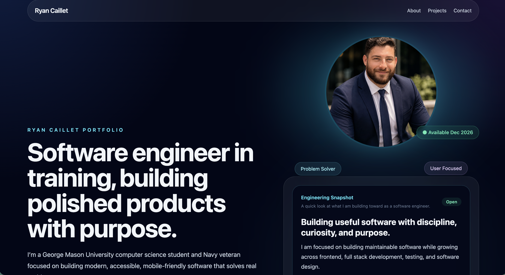

# Ryan Caillet Portfolio

A modern software engineering portfolio showcasing my projects, technical growth, and approach to building clean, maintainable software.

> Built with React, TypeScript, Tailwind CSS, and Framer Motion.



---

## Live Website

Coming soon

---

## Overview

This portfolio serves as the central hub for my software engineering projects and documents my journey toward becoming a software engineer.

Rather than acting as a simple collection of projects, it demonstrates my engineering philosophy, technical skills, and commitment to writing clean, maintainable software.

Inside you'll find:

- Featured software engineering projects
- Project case studies
- My engineering philosophy
- Technical skills and technologies
- Professional experience and educational journey
- Ways to get in touch

---

## Features

- Responsive design across desktop, tablet, and mobile
- Modern React architecture
- TypeScript throughout the application
- Tailwind CSS styling
- Framer Motion animations
- Reusable component-based architecture
- Accessibility-conscious design
- Smooth scrolling navigation
- Recruiter-focused project showcase
- Interactive UI with polished user experience

---

## Tech Stack

### Frontend

- React
- TypeScript
- Tailwind CSS
- Framer Motion
- Vite

### Development Tools

- Git
- GitHub
- VS Code
- ESLint

---

## Running Locally

Clone the repository

```bash
git clone https://github.com/rycaillet/ryan-portfolio.git
```

Navigate into the project

```bash
cd ryan-portfolio
```

Install dependencies

```bash
npm install
```

Start the development server

```bash
npm run dev
```

Create a production build

```bash
npm run build
```

---

## Project Structure

```text
src/
│
├── assets/
├── components/
├── sections/
├── hooks/
├── utils/
├── App.tsx
└── main.tsx
```

---

## Engineering Goals

This portfolio was designed around a few core principles:

- Write clean, maintainable code
- Build responsive user interfaces
- Create accessible experiences
- Develop reusable components
- Deliver polished user experiences
- Continuously improve as an engineer

---

## Future Roadmap

Upcoming additions include:

- Detailed project case studies
- Full-stack flagship project
- AI Golf Swing Coach
- Additional engineering projects
- Continued accessibility improvements
- Performance optimization

---

## About Me

I'm Ryan Caillet, a Computer Science student at George Mason University graduating in December 2026 and a U.S. Navy veteran.

I'm passionate about building software that is clean, maintainable, accessible, and enjoyable to use. Every project I build is an opportunity to improve both my technical skills and my ability to solve real problems.

---

## Connect

- Portfolio *(Coming soon)*
- LinkedIn: https://www.linkedin.com/in/ryan-caillet
- GitHub: https://github.com/rycaillet

---

## License

This project is licensed under the MIT License.